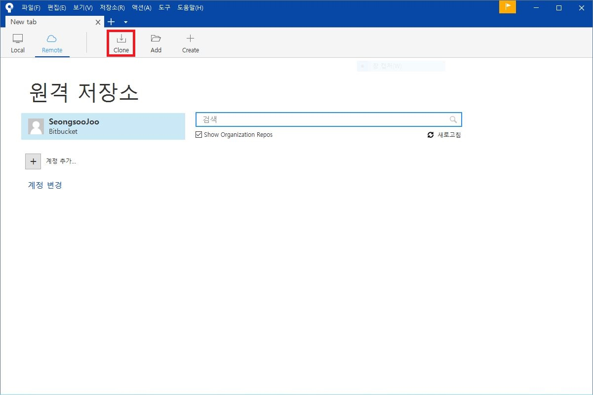
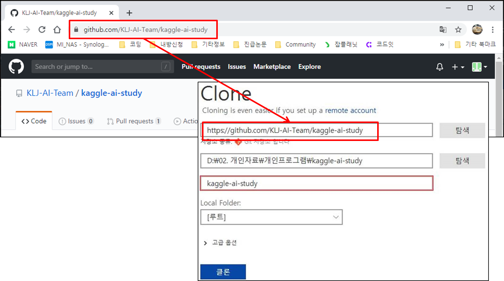
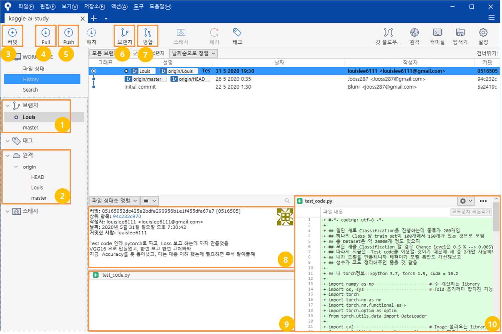
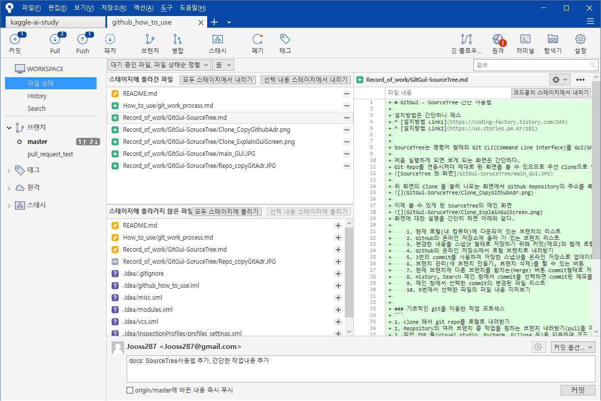

# GitGui - SourceTree 간단 사용법

설치방법은 간단하니 패스  
* [설치방법 Link1](https://coding-factory.tistory.com/249)
* [설치방법 Link2](https://ux.stories.pe.kr/181)

SourceTree는 명령어 형태의 Git CLI(Command Line Interface)를 GUI(Graphic User Interface)로 사용자가 편리하게 사용 할 수 있는 무료 소프트웨어이다.  

처음 실행하게 되면 보게 되는 화면은 간단하다.
Git Repo를 연동시켜야 제대로 된 화면을 볼 수 있으므로 우선 Clone으로 연동하는 작업부터 한다.

위 화면의 Clone 을 눌러 나오는 화면에서 Github Repository의 주소를 복사해서 붙여넣고 저장소 폴더 설정을 한 뒤 클론을 누른다
  

이제 볼 수 있게 된 SourceTree의 메인 화면

화면에 대한 설명을 간단히 하면 아래와 같다.

    1. 현재 로컬(내 컴퓨터)에 다운되어 있는 브랜치의 리스트
    2. GitHub의 온라인 저장소에 올라 가 있는 브랜치 리스트
    3. 변경한 내용을 스냅샷 형태로 저장하기 위해 커밋(메모)와 함께 로컬 내에서 저장(아직 온라인에 올라가지 않음)
    4. Github의 온라인 저장소에서 로컬 브랜치로 내려받기
    5. 3번의 commit을 사용하여 저장한 스냅샷을 온라인 저장소로 업데이트
    6. 브랜치 관리(새 브랜치 만들기, 브랜치 삭제)를 할 수 있는 버튼
    7. 현재 브랜치에 다른 브랜치를 합치는(Merge) 버튼 Commit형태로 저장된 대상을 합치게 된다.
    8. History, Search 메인 창에서 commit를 선택하면 commit된 메모를 볼 수 있는 창
    9. 메인 창에서 선택한 commit의 변경된 파일 리스트
    10. 9번에서 선택한 파일의 파일 내용 미리보기

[Git을 이용한 작업 프로세스 보기](How_to_use/git_work_process.md)

작업을 완료했다면 commit과 push를 해 보자.
편의상 다른작업 repo의 작업내용을 들고 왔다.

스테이지에 올라간 파일은 push하여 온라인으로 올릴 파일  
스테이지에 올라가지 않은 파일은 이전 commit대비 변경된 것이 있지만 온라인으로 올리지 않을 것으로 이해하면 쉽다.
아래의 '커밋 내용'을 적고 커밋을 하면 완료

